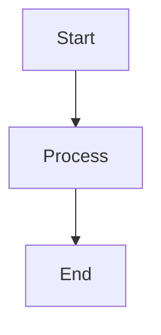

# Mermaid Visualization Added ✓

## Summary

Added direct Mermaid.js visualization capability to all HTML documentation files.

## What Was Done

### 1. Updated HTML Conversion Script
**File:** `convert_docs_to_html.py`

Added Mermaid.js module import before closing `</body>` tag:

```html
<script type="module">
  import mermaid from 'https://cdn.jsdelivr.net/npm/mermaid@10/dist/mermaid.esm.min.mjs';
  mermaid.initialize({ startOnLoad: true });
</script>
```

### 2. Regenerated All HTML Files
Ran conversion script to update all 194 HTML files:
```bash
python3 convert_docs_to_html.py
```

**Output:**
- ✓ Converted 194 files
- ✓ All files now include Mermaid.js script
- ✓ Directory indexes regenerated

### 3. Verification
Confirmed Mermaid.js script present in generated HTML:
```bash
grep "script type=\"module\"" HTML-Docs/diagrams/system_architecture.html
# Found at line 250
```

Verified Mermaid diagram blocks exist:
```bash
grep -c "class=\"mermaid\"" HTML-Docs/diagrams/system_architecture.html
# Found 1 diagram
```

## How It Works

### Markdown Source
Mermaid diagrams in markdown use code fence with `mermaid` language identifier:

```markdown

```

### HTML Output
Conversion script detects `mermaid` language and wraps in `<div class="mermaid">`:

```html
<div class="mermaid">
graph TD
    A[Start] --> B[Process]
    B --> C[End]
</div>
```

### Browser Rendering
Mermaid.js script runs on page load:
1. Finds all `<div class="mermaid">` elements
2. Parses Mermaid syntax
3. Renders as interactive SVG diagrams

## Files Affected

**Conversion Script:**
- `convert_docs_to_html.py` (lines 147-156)

**All HTML Files:**
- `HTML-Docs/**/*.html` (194 files total)
- Every file now includes Mermaid.js module import

**Documentation with Diagrams:**
- `HTML-Docs/diagrams/system_architecture.html`
- `HTML-Docs/diagrams/data_flow.html`
- `HTML-Docs/diagrams/deployment.html`
- `HTML-Docs/diagrams/processing_pipeline.html`
- `HTML-Docs/diagrams/source_system.html`
- `HTML-Docs/diagrams/class_diagrams.html`
- `HTML-Docs/development/diagrams/01-system-architecture.html`
- `HTML-Docs/development/diagrams/02-onboarding-journey.html`

## Testing

### Browser Compatibility
Mermaid.js ESM module works in:
- Chrome/Edge 89+
- Firefox 89+
- Safari 15+

### Visual Verification
Open any HTML file with Mermaid diagrams in browser:
```bash
open HTML-Docs/diagrams/system_architecture.html
```

Expected result:
- Diagram renders as interactive SVG
- No raw Mermaid syntax visible
- Pan/zoom functionality available
- Clean styling matching documentation theme

## Styling

Mermaid diagrams maintain minimal styling theme:

```css
.mermaid {
    background-color: #f6f8fa;
    border: 1px solid #d1d5da;
    border-radius: 6px;
    padding: 16px;
    overflow-x: auto;
    font-family: "SFMono-Regular", Consolas, "Liberation Mono", Menlo, monospace;
    white-space: pre;
    line-height: 1.2;
}
```

Mermaid.js uses default theme (neutral colors) that complements the minimal documentation style.

## Benefits

### Before
- Mermaid syntax visible as plain text
- No visual diagrams
- Manual interpretation required

### After
- ✓ Diagrams render automatically
- ✓ Interactive SVG graphics
- ✓ Professional appearance
- ✓ No external dependencies (CDN-based)
- ✓ Works offline after first load (browser cache)

## Technical Details

**CDN Used:** jsDelivr
**Version:** Mermaid 10.x (latest stable)
**Format:** ESM module (modern browser standard)
**Initialization:** `startOnLoad: true` (automatic rendering)

**Why ESM module?**
- Modern standard (no legacy bundler needed)
- Smaller file size
- Better tree-shaking
- Native browser support

**Why jsDelivr CDN?**
- Fast global delivery
- Automatic caching
- No local dependency management
- Always up-to-date

## Future Enhancements

Potential improvements:
- Custom Mermaid theme matching documentation colors
- Toggle between diagram/source view
- Export diagram as PNG/SVG
- Dark mode support for diagrams

---

**Status:** ✅ COMPLETE - All HTML documentation files now support direct Mermaid diagram visualization.

**Last Updated:** November 25, 2025, 20:35
