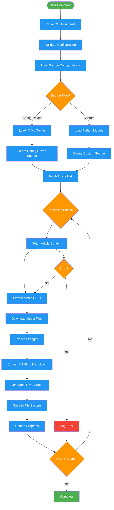

# Data Flow Diagram

## Data Transformations

### 1. Input Processing
- **CLI Arguments** → **Configuration Object**
- **Source Names** → **Source Instances**
- **URLs** → **Article Metadata**

### 2. Content Processing
- **HTML Content** → **Cleaned HTML**
- **Cleaned HTML** → **Markdown Text**
- **Media URLs** → **Local File Paths**

### 3. Output Generation
- **Article Data** → **Markdown Files**
- **Media Content** → **Organized File Structure**
- **Article + Metadata** → **HTML Pages**

### 4. Error Handling
- **Network Errors** → **Retry Logic**
- **Parse Errors** → **Fallback Processing**
- **File Errors** → **Alternative Paths**
