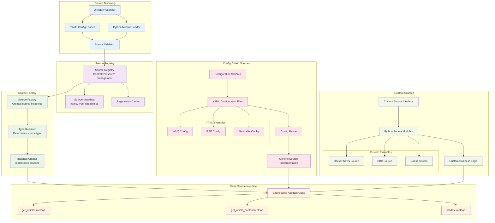

# Source System Architecture

## Source Types Comparison

| Aspect | Config-Driven | Custom |
|--------|---------------|--------|
| **Setup Time** | 15-30 minutes | 2-4 hours |
| **Complexity** | Simple HTML parsing | Full Python implementation |
| **Flexibility** | Limited to CSS selectors | Complete control |
| **Maintenance** | YAML config updates | Code changes required |
| **Comments Support** | No | Yes |
| **Custom Logic** | No | Yes |
| **Examples** | InfoQ, IEEE, Mashable | HN, BBC, Nature |

## Source Registration Process

1. **Directory Scan**: Scan `sources/active/` directory
2. **Type Detection**: Identify config-driven vs custom sources
3. **Validation**: Validate configuration/implementation
4. **Registration**: Add to source registry with metadata
5. **Caching**: Store registration data for performance
