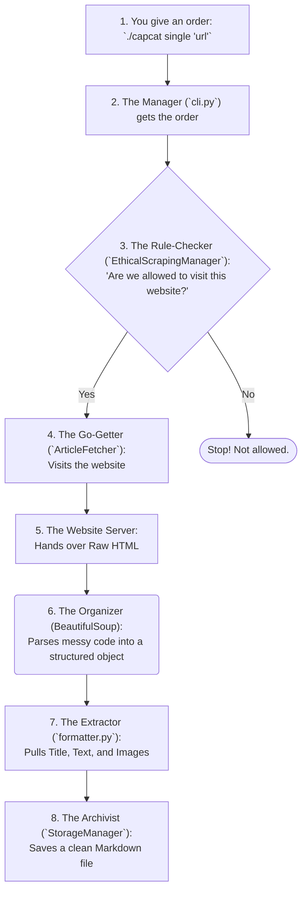

# Capcat's Article Fetching Flow: A Simple Guide

This guide explains how Capcat goes from a URL you provide to a neatly saved Markdown file on your computer. Imagine you've asked a super-smart robot assistant to grab a magazine article for you.

---

## The Step-by-Step Journey

### Step 1: You Give an Order
You start everything by typing a command in your terminal, like telling your robot assistant, "Hey, go get me this article."
- **You type:** `./capcat single "https://www.example.com/cool-article"`

### Step 2: The Manager Gets the Order
Capcat's `cli.py` script is like the manager of the robot team. It hears your command, understands you want a single article from a specific URL, and tells the team to get to work.

### Step 3: The Rule-Checker
Before your robot rushes off, the `EthicalScrapingManager` steps in. It's the team's rule-checker. It pulls up the website's rulebook (`robots.txt`) to make sure your robot is welcome. It answers questions like:
- "Are we allowed to visit this part of the site?"
- "How long should we wait between requests so we don't overload their server?"
If the rules say "No," the process stops. Otherwise, it's full speed ahead!

### Step 4: The Go-Getter
The `ArticleFetcher` is the robot that does the actual traveling. It goes to the web address you gave.

### Step 5: The Website Hands Over the "Article"
The website's server sees your robot, says "Hello," and hands over the article. But it doesn't hand over a clean, readable page. It hands over the raw **HTML code**.
Imagine getting a book where all the words, chapter titles, and picture captions are smashed together into one giant, unreadable paragraph. That's raw HTML.

### Step 6: The Organizer (This is BeautifulSoup!)
The raw HTML is useless on its own. So, Capcat gives it to **BeautifulSoup**.

BeautifulSoup is the master organizer. It doesn't read or understand the article, but it knows the *language of HTML*. It takes that giant, messy paragraph of code and structures it perfectly. It's like turning the messy book into a neat filing cabinet where:
- The title is in the "Title" drawer.
- Every paragraph is in the "Paragraphs" drawer.
- Every image is in the "Images" drawer.

### Step 7: The Extractor
Now that everything is organized, the `formatter.py` (or a specialized scraper) comes in. It's the extractor that knows exactly what to look for. It goes to the filing cabinet created by BeautifulSoup and:
- Pulls out the title from the "Title" drawer.
- Grabs all the text from the "Paragraphs" drawer.
- Takes all the links from the "Images" drawer.
- It ignores all the junk drawers, like "Ads" and "Menus."

### Step 8: The Archivist
Finally, the `StorageManager` takes all the clean, extracted content (the title, text, and image links) and writes it all down in a simple, clean **Markdown file** on your computer.

And that's it! You now have a perfectly readable, ad-free article saved forever.
