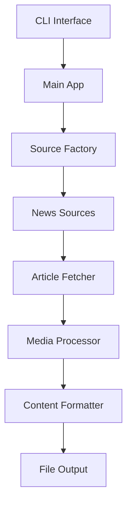

# Capcat - News Article Archiving System

A powerful, modular news article archiving system that fetches articles from 13+ sources, converts them to Markdown, and organizes them with media files.

##  Features

- **Multi-Source Support**: 13+ news sources including Hacker News, BBC, Nature, IEEE
- **Modular Architecture**: Easy to add new sources with config-driven or custom implementations
- **Media Handling**: Automatic download and organization of images, videos, and documents
- **Flexible Output**: Markdown files with optional HTML generation
- **Parallel Processing**: Concurrent article processing for performance
- **Privacy Compliant**: Usernames anonymized, no personal data stored
- **Configurable**: Command-line arguments, environment variables, and config files

##  Requirements

- Python 3.8+
- Internet connection for article fetching
- ~100MB disk space for dependencies

##  Installation

### Quick Setup

```bash
# Clone repository
git clone <repository-url>
cd capcat

# Setup environment
python3 -m venv venv
source venv/bin/activate
pip install -r requirements.txt

# Verify installation
./capcat list sources
```

### Docker (Alternative)

```bash
docker build -t capcat .
docker run -v $(pwd)/output:/app/output capcat bundle tech --count 10
```

##  Quick Start

```bash
# Fetch 10 tech articles
./capcat bundle tech --count 10

# Fetch from specific sources
./capcat fetch hn,bbc --count 15 --media

# Single article processing
./capcat single https://example.com/article

# List available sources
./capcat list sources

# Show bundles
./capcat list bundles
```

##  Usage

### Command Line Interface

```bash
# Basic usage
./capcat <command> [options]

# Commands
list sources           # Show all available sources
list bundles          # Show predefined source bundles
fetch <sources>       # Fetch from specific sources
bundle <name>         # Fetch from predefined bundle
single <url>          # Process single article

# Options
--count N             # Number of articles (default: 30)
--media               # Download videos/audio/documents
--html                # Generate HTML output
--output-dir DIR      # Custom output directory
--config FILE         # Custom config file
--debug               # Enable debug logging
```

### Available Sources

**Technology:**
- `hn` - Hacker News
- `lb` - Lobsters
- `iq` - InfoQ
- `ieee` - IEEE Spectrum
- `mashable` - Mashable

**News:**
- `bbc` - BBC News
- `guardian` - The Guardian

**Science:**
- `nature` - Nature News
- `scientificamerican` - Scientific American

**AI/ML:**
- `mitnews` - MIT News

**Sports:**
- `bbcsport` - BBC Sport

### Predefined Bundles

```bash
./capcat bundle tech          # ieee + mashable
./capcat bundle techpro       # hn + lb + iq
./capcat bundle news          # bbc + guardian
./capcat bundle science       # nature + scientificamerican
./capcat bundle ai            # mitnews
./capcat bundle sports        # bbcsport
```

##  Output Structure

### Batch Processing
```
../News/news_DD-MM-YYYY/
├── Source_DD-MM-YYYY/
│   └── NN_Article_Title/
│       ├── article.md
│       ├── images/
│       ├── files/
│       └── html/ (if --html)
```

### Single Articles
```
../Capcats/cc_DD-MM-YYYY-Title/
├── article.md
├── images/
└── files/
```

##  Configuration

### Command Line (Highest Priority)
```bash
./capcat fetch hn --count 20 --media
```

### Environment Variables
```bash
export CAPCAT_OUTPUT_DIR="/custom/path"
export CAPCAT_DEFAULT_COUNT=50
```

### Config File (`capcat.yml`)
```yaml
output_dir: "/custom/path"
default_count: 50
media_download: true
sources:
  hn:
    rate_limit: 5
```

##  Development

### Adding a New Source

#### Config-Driven (15-30 minutes)
```yaml
# sources/active/config_driven/configs/newsource.yaml
display_name: "New Source"
base_url: "https://newsource.com/"
category: tech
article_selectors: [".headline a"]
content_selectors: [".article-content"]
```

#### Custom Implementation (2-4 hours)
```python
# sources/active/custom/newsource/source.py
from core.source_system.base_source import BaseSource

class NewSource(BaseSource):
    def get_articles(self, count=30):
        # Custom implementation
        pass
```

### Verification
```bash
# Verify all sources work
./capcat list sources

# Verify specific source
./capcat fetch newsource --count 5

# Verify bundle
./capcat bundle tech --count 10
```

##  Architecture



**Key Components:**
- **Source System**: Modular source management with auto-discovery
- **Processing Pipeline**: Parallel article processing with error handling
- **Media Handling**: Intelligent media download and organization
- **Output Generation**: Markdown and HTML with structured directories

##  Common Issues & Solutions

### Module Not Found
```bash
# Use wrapper (handles venv automatically)
./capcat list sources

# Or activate manually
source venv/bin/activate
```

### Source Failures
- 90% success rate is normal (anti-bot protection)
- Some sources may have temporary issues
- Check debug logs for details

### Performance Issues
```bash
# Reduce parallel workers
export CAPCAT_MAX_WORKERS=4

# Enable progress tracking
./capcat fetch hn --count 10 --debug
```

##  Documentation

- [API Reference](docs/api/README.md) - Complete API documentation
- [Architecture Guide](docs/architecture/system.md) - System design details
- [Developer Guide](docs/developer/guide.md) - Contributing and development
- [Source Development](docs/developer/sources.md) - Adding new sources

## 🤝 Contributing

1. Fork the repository
2. Create feature branch: `git checkout -b feature/new-feature`
3. Follow PEP 8 coding standards
4. Update documentation
5. Submit pull request

## License

MIT-Style Non-Commercial License - see [LICENSE.txt](../LICENSE.txt) file for details.

**Copyright (c) 2025 Stayu Kasabov**

- Non-commercial use only
- Attribution required
- Share-alike modifications
- Contributions welcome

## Acknowledgments

- Built with Python 3.8+
- Uses BeautifulSoup4 for HTML parsing
- Requests library for HTTP handling
- Threading for parallel processing

##  Support

- Create an issue on GitHub
- Check existing documentation
- Review troubleshooting guide

---

**Note**: This tool is designed for personal archiving and research purposes. Please respect robots.txt and terms of service for all sources.
