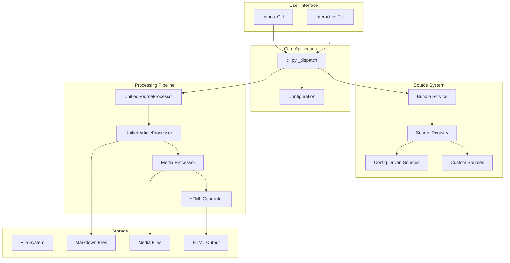

# System Architecture

## Overview

Capcat is a modular news article archiving system installed as a pipx package. Entry point: `capcat` CLI command.

## Architecture Diagram

```mermaid
graph TB
    subgraph "User Interface"
        CLI[capcat CLI]
        TUI[Interactive TUI]
    end

    subgraph "Core Application"
        Dispatch[cli.py _dispatch]
        Config[Configuration]
    end

    subgraph "Source System"
        Registry[Source Registry]
        ConfigDriven[Config-Driven Sources]
        Custom[Custom Sources]
        BundleService[Bundle Service]
    end

    subgraph "Processing Pipeline"
        USP[UnifiedSourceProcessor]
        UAP[UnifiedArticleProcessor]
        MediaProc[Media Processor]
        HTMLGen[HTML Generator]
    end

    subgraph "Storage"
        FileSystem[File System]
        Markdown[Markdown Files]
        Media[Media Files]
        HTML[HTML Output]
    end

    CLI --> Dispatch
    TUI --> Dispatch
    Dispatch --> Config
    Dispatch --> BundleService
    BundleService --> Registry
    Registry --> ConfigDriven
    Registry --> Custom
    Dispatch --> USP
    USP --> UAP
    UAP --> MediaProc
    MediaProc --> HTMLGen
    HTMLGen --> HTML
    UAP --> Markdown
    MediaProc --> Media
```

## Component Responsibilities

### Entry Point

- **capcat/cli.py**: `_dispatch()` routes subcommands (`fetch`, `single`, `bundle`, `catch`, etc.) to `_cmd_*` handlers

### Source System

- **Source Registry**: Auto-discovers sources from `capcat/sources/builtin/` and user-added sources
- **Config-Driven Sources**: YAML-configured sources (`configs/*.yaml`)
- **Custom Sources**: Python-implemented sources (HN, Lobsters) with comment support
- **Bundle Service**: Expands bundle names to ordered source ID lists

### Processing Pipeline

- **UnifiedSourceProcessor** (`core/unified_source_processor.py`): Batch article processing pipeline
- **UnifiedArticleProcessor** (`core/unified_article_processor.py`): Per-article routing — checks URL against specialized sources (Twitter, YouTube, Medium, Substack) before falling back to generic fetcher
- **Media Processor**: Downloads images unconditionally; video/audio/docs gated by `--media` flag
- **HTML Generator** (`htmlgen/`): Creates browsable HTML from processed Markdown

### Configuration

- `core/config/`: `get_news_dir()`, `get_capcats_dir()` — output path resolution
- Priority: CLI args → ENV vars → `capcat.yml` → defaults

## Data Flow

1. **Input**: User specifies sources/bundles via CLI or TUI
2. **Bundle Expansion**: Bundle names resolved to source ID lists
3. **Source Resolution**: Registry instantiates source objects
4. **Article Discovery**: Sources fetch article lists
5. **Content Processing**: Articles processed through UnifiedArticleProcessor
6. **Media Handling**: Images downloaded; other media conditional on `--media`
7. **Output Generation**: Markdown + optional HTML written to structured directories

## Output Structure

- Batch (`fetch`/`bundle`): `~/Desktop/Vault/News/News_DD-MM-YYYY/Source_DD-MM-YYYY/NN_Title/`
- Single (`single`): `~/Desktop/Vault/Capcats/cc_DD-MM-YYYY-Title/`
- HTML: `*/html/` within the above (requires `--html` flag)

## Scalability

- **Parallel Processing**: `ThreadPoolExecutor` for concurrent article processing
- **Session Pooling** (`core/session_pool.py`): Shared HTTP connections, `Accept-Encoding: gzip, deflate` (no brotli)
- **Modular Sources**: New sources require only a YAML config or Python class — zero core changes
- **Rate Limiting**: 1 req/10 sec enforced per source
