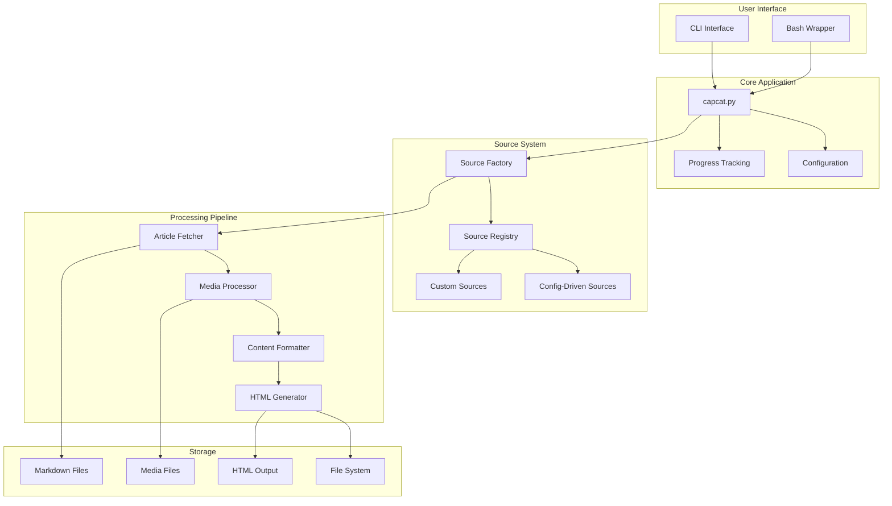

# System Architecture

## Overview

Capcat is a modular news article archiving system designed for scalability and extensibility.

## Architecture Diagram

## Component Responsibilities

### Core Application Layer

- **capcat.py**: Main application orchestrator
- **cli.py**: Command-line argument parsing and validation
- **core.config**: Configuration management and validation

### Source System

- **Source Factory**: Creates and manages source instances
- **Source Registry**: Auto-discovers and registers available sources
- **Config-Driven Sources**: YAML-configured simple sources
- **Custom Sources**: Python-implemented complex sources with comments

### Processing Pipeline

- **Article Fetcher**: Downloads and processes article content
- **Media Processor**: Handles images, videos, and other media
- **Content Formatter**: Converts HTML to Markdown
- **HTML Generator**: Creates browsable HTML versions

## Design Patterns

### Factory Pattern
Used for source creation to support multiple source types.

### Registry Pattern
Auto-discovery and registration of available sources.

### Template Method Pattern
Base classes define processing flow, subclasses implement specifics.

### Observer Pattern
Progress tracking and logging throughout the pipeline.

## Data Flow

1. **Input**: User specifies sources and parameters via CLI
2. **Source Resolution**: Factory creates appropriate source instances
3. **Article Discovery**: Sources fetch article lists
4. **Content Processing**: Articles downloaded and processed in parallel
5. **Media Handling**: Images and media downloaded and organized
6. **Output Generation**: Markdown and HTML files created
7. **Storage**: Files organized in structured directory hierarchy

## Scalability Considerations

- **Parallel Processing**: ThreadPoolExecutor for concurrent article processing
- **Session Pooling**: Shared HTTP connections for performance
- **Modular Sources**: Easy addition of new sources without core changes
- **Configurable Limits**: Rate limiting and resource management

