# System Architecture Diagrams

## Complete System Architecture

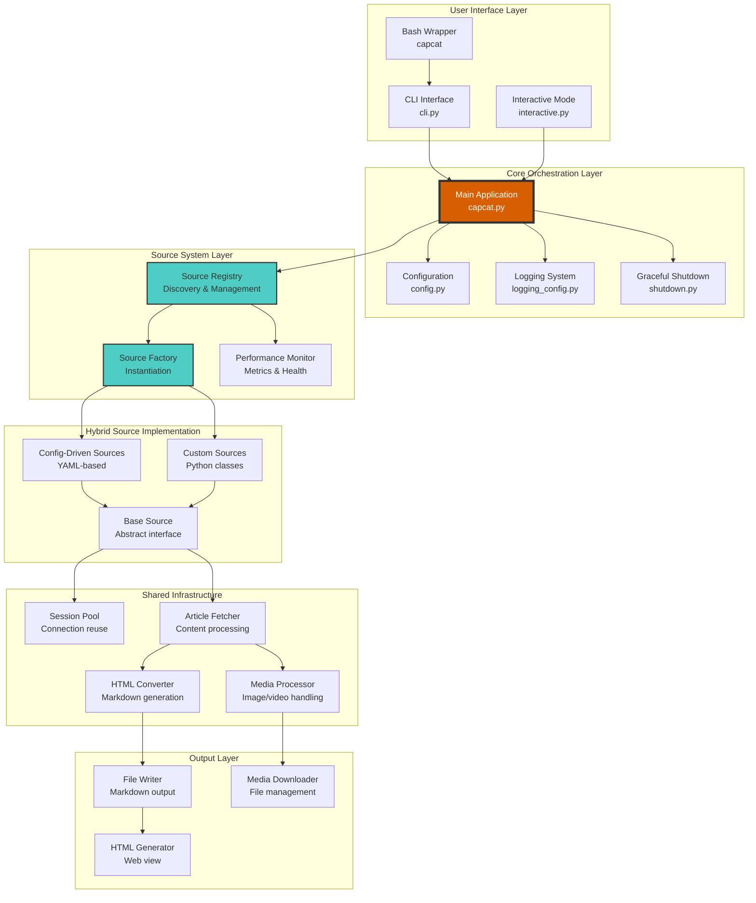

## Data Flow Architecture

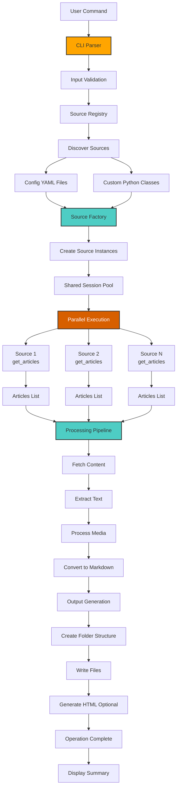

## Hybrid Source System

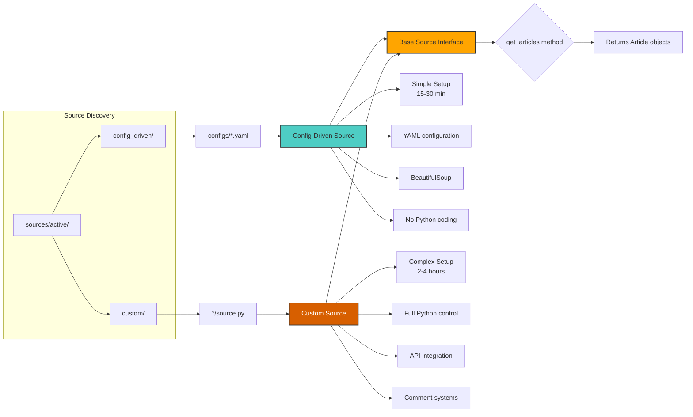

## Design Patterns Applied

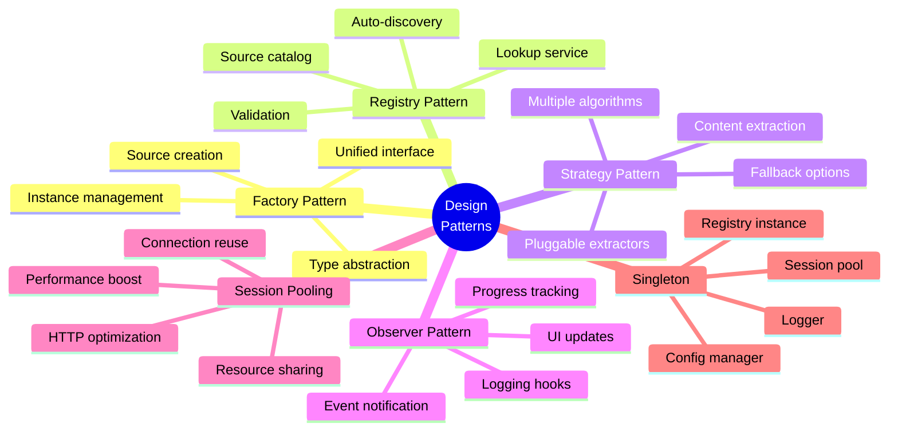

## Processing Pipeline Detailed

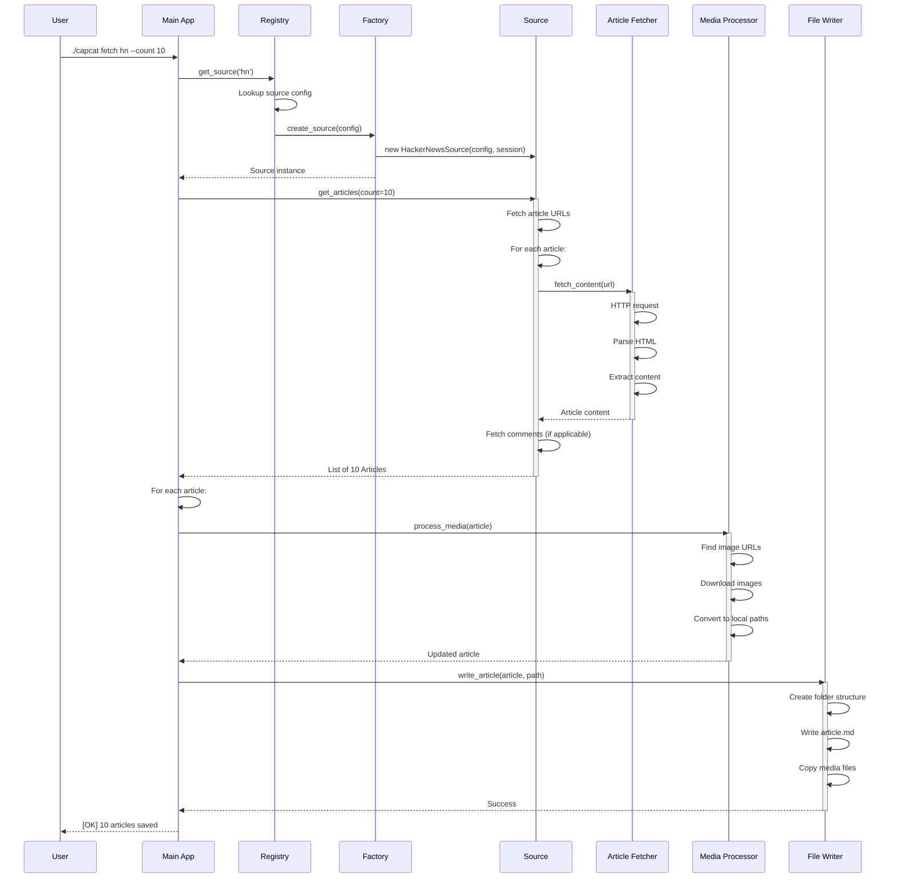

## Error Handling Hierarchy

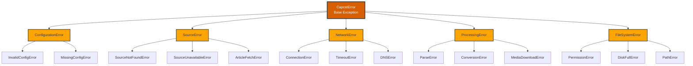

## Performance Optimization Strategy

```mermaid
graph TB
    subgraph Optimization Techniques
        A1[Parallel Processing]
        A2[Connection Pooling]
        A3[Lazy Loading]
        A4[Caching]
    end

    A1 --> B1[ThreadPoolExecutor]
    A1 --> B2[Concurrent article fetching]
    A1 --> B3[5x faster than sequential]

    A2 --> C1[requests.Session reuse]
    A2 --> C2[HTTP keep-alive]
    A2 --> C3[70% time reduction]

    A3 --> D1[Content on demand]
    A3 --> D2[Comments when needed]
    A3 --> D3[Memory efficient]

    A4 --> E1[Config file caching]
    A4 --> E2[@lru_cache decorator]
    A4 --> E3[Avoid redundant I/O]

    B1 --> F[Performance Gains]
    C1 --> F
    D1 --> F
    E1 --> F

    F --> G[50-70% Faster<br/>Overall]

    style F fill:#4ecdc4,stroke:#333,stroke-width:2px
    style G fill:#d75f00,stroke:#333,stroke-width:4px,color:#fff
```

## Module Dependencies

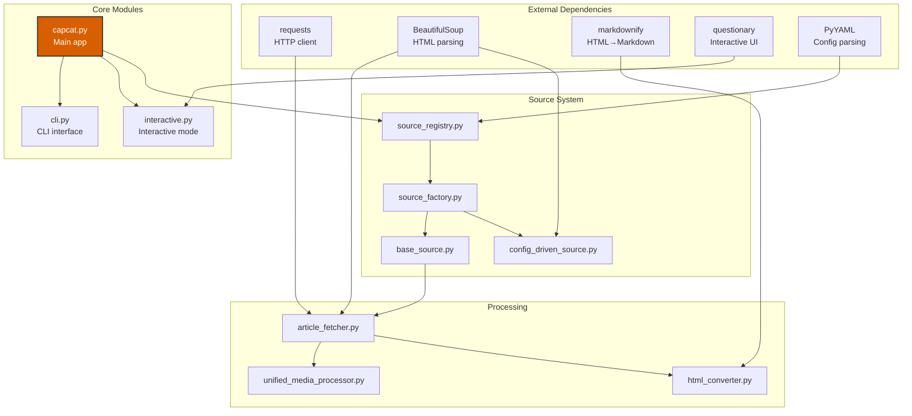

## Configuration System

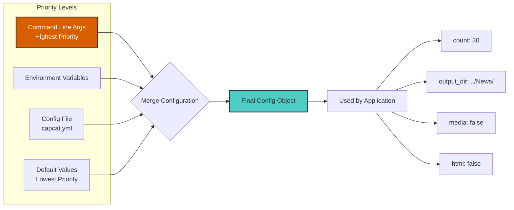

## Security Architecture

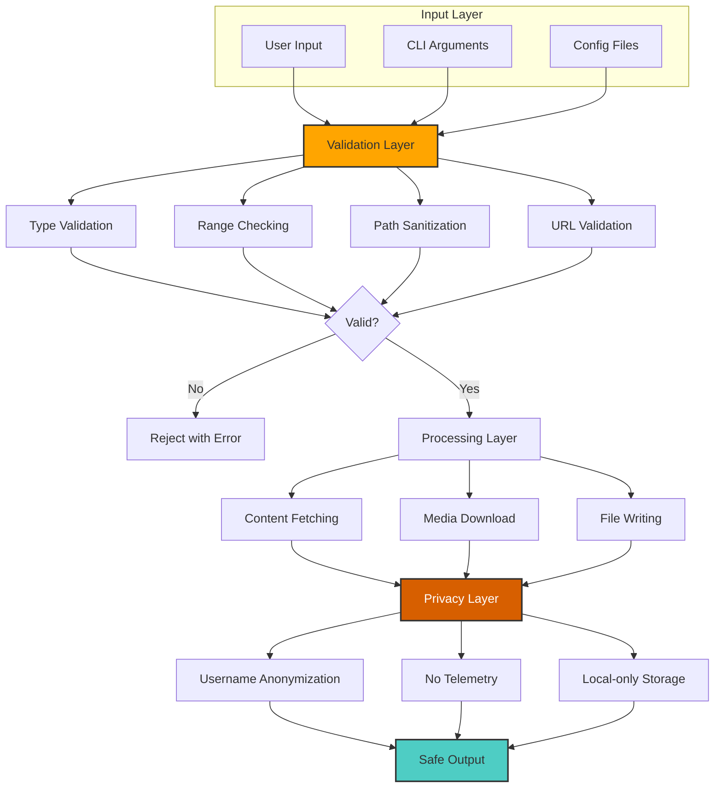

## Component Communication

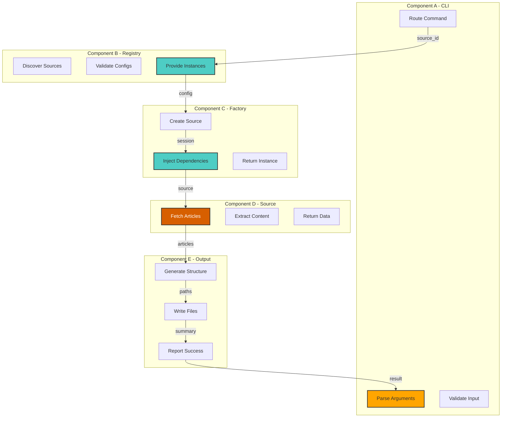

## Scalability Architecture

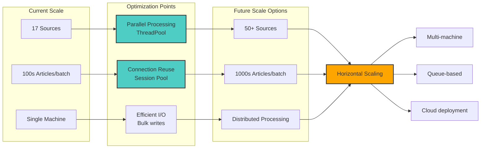

## Architecture Evolution

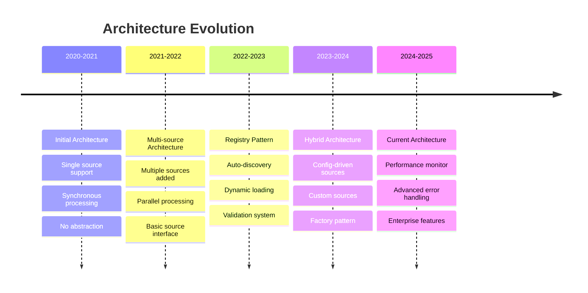

## Technology Stack

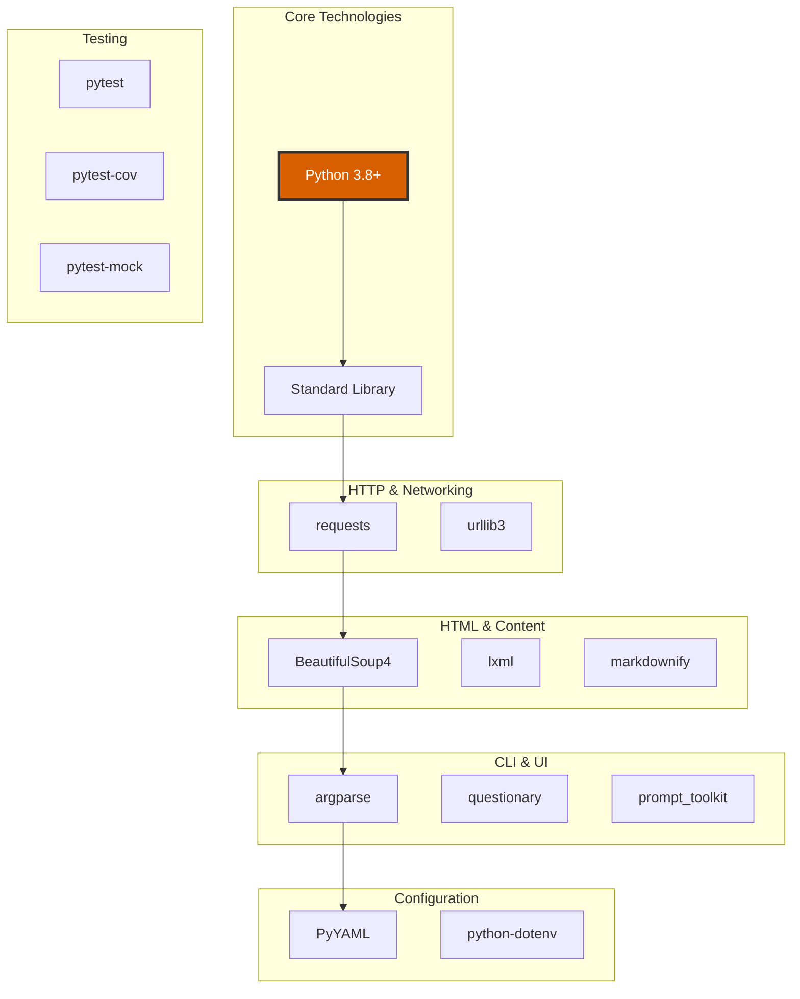
