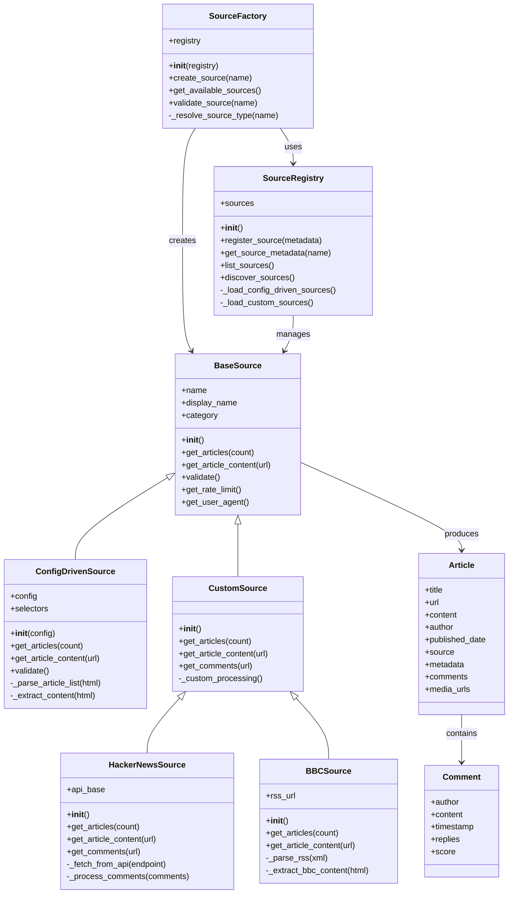
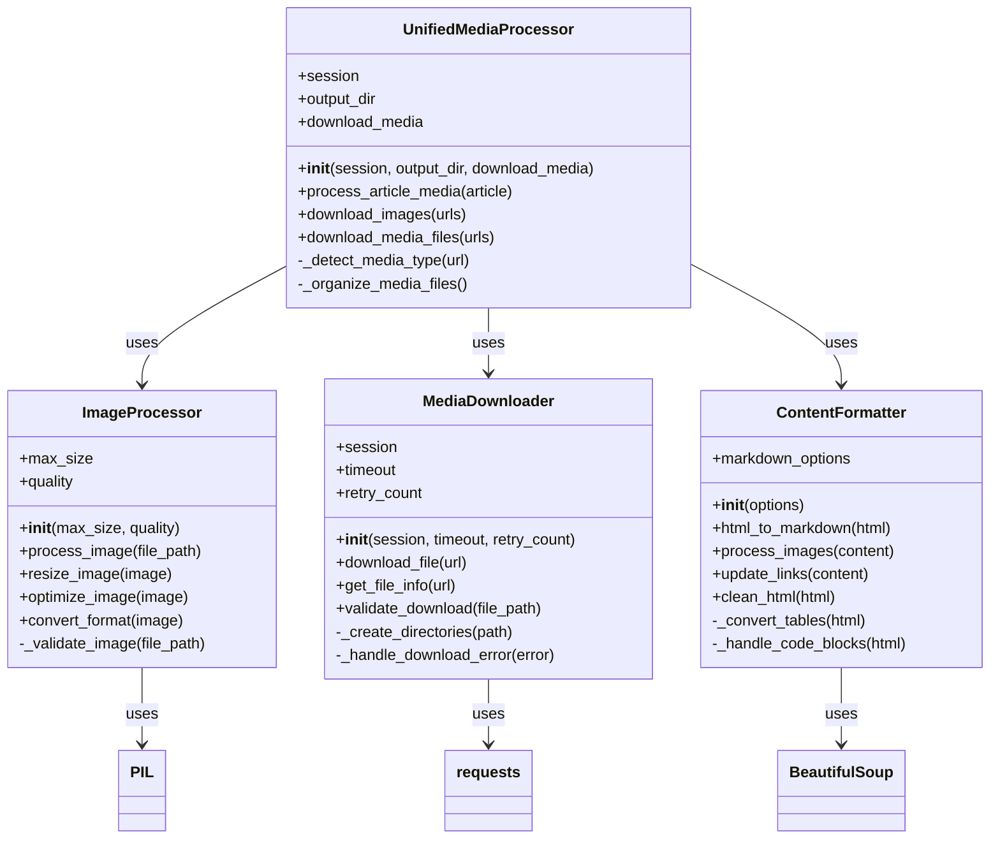
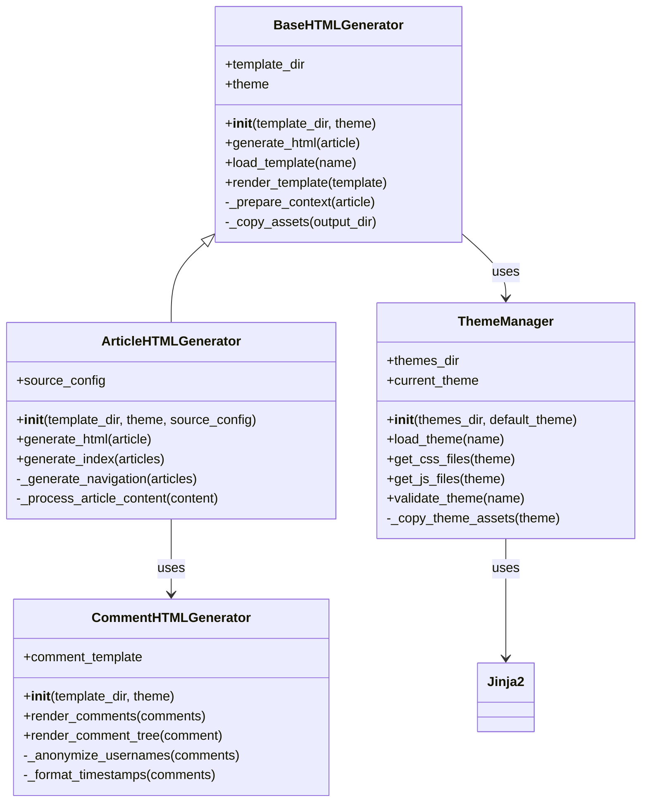
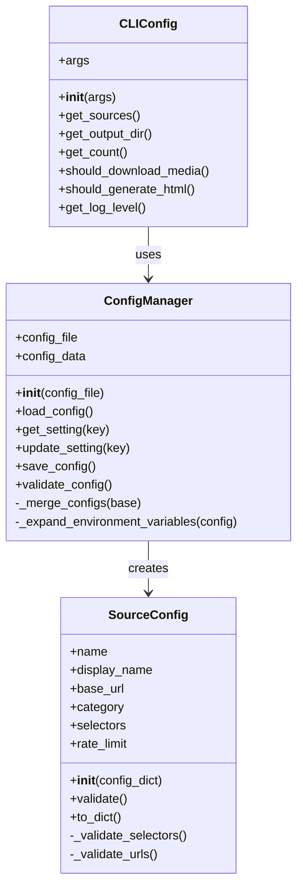

# Class Diagrams

## Core Source System Classes

```mermaid
classDiagram
    class BaseSource {
        +name
        +display_name
        +category
        +__init__()
        +get_articles(count)
        +get_article_content(url)
        +validate()
        +get_rate_limit()
        +get_user_agent()
    }

    class ConfigDrivenSource {
        +config
        +selectors
        +__init__(config)
        +get_articles(count)
        +get_article_content(url)
        +validate()
        -_parse_article_list(html)
        -_extract_content(html)
    }

    class CustomSource {
        +__init__()
        +get_articles(count)
        +get_article_content(url)
        +get_comments(url)
        -_custom_processing()
    }

    class HackerNewsSource {
        +api_base
        +__init__()
        +get_articles(count)
        +get_article_content(url)
        +get_comments(url)
        -_fetch_from_api(endpoint)
        -_process_comments(comments)
    }

    class BBCSource {
        +rss_url
        +__init__()
        +get_articles(count)
        +get_article_content(url)
        -_parse_rss(xml)
        -_extract_bbc_content(html)
    }

    class SourceFactory {
        +registry
        +__init__(registry)
        +create_source(name)
        +get_available_sources()
        +validate_source(name)
        -_resolve_source_type(name)
    }

    class SourceRegistry {
        +sources
        +__init__()
        +register_source(metadata)
        +get_source_metadata(name)
        +list_sources()
        +discover_sources()
        -_load_config_driven_sources()
        -_load_custom_sources()
    }

    class Article {
        +title
        +url
        +content
        +author
        +published_date
        +source
        +metadata
        +comments
        +media_urls
    }

    class Comment {
        +author
        +content
        +timestamp
        +replies
        +score
    }

    BaseSource <|-- ConfigDrivenSource
    BaseSource <|-- CustomSource
    CustomSource <|-- HackerNewsSource
    CustomSource <|-- BBCSource
    SourceFactory --> BaseSource  : creates
    SourceFactory --> SourceRegistry  : uses
    SourceRegistry --> BaseSource  : manages
    BaseSource --> Article  : produces
    Article --> Comment  : contains
```

## Media Processing Classes

```mermaid
classDiagram
    class UnifiedMediaProcessor {
        +session
        +output_dir
        +download_media
        +__init__(session, output_dir, download_media)
        +process_article_media(article)
        +download_images(urls)
        +download_media_files(urls)
        -_detect_media_type(url)
        -_organize_media_files()
    }

    class ImageProcessor {
        +max_size
        +quality
        +__init__(max_size, quality)
        +process_image(file_path)
        +resize_image(image)
        +optimize_image(image)
        +convert_format(image)
        -_validate_image(file_path)
    }

    class MediaDownloader {
        +session
        +timeout
        +retry_count
        +__init__(session, timeout, retry_count)
        +download_file(url)
        +get_file_info(url)
        +validate_download(file_path)
        -_create_directories(path)
        -_handle_download_error(error)
    }

    class ContentFormatter {
        +markdown_options
        +__init__(options)
        +html_to_markdown(html)
        +process_images(content)
        +update_links(content)
        +clean_html(html)
        -_convert_tables(html)
        -_handle_code_blocks(html)
    }

    UnifiedMediaProcessor --> ImageProcessor  : uses
    UnifiedMediaProcessor --> MediaDownloader  : uses
    UnifiedMediaProcessor --> ContentFormatter  : uses
    ImageProcessor --> PIL  : uses
    MediaDownloader --> requests  : uses
    ContentFormatter --> BeautifulSoup  : uses
```

## HTML Generation Classes

```mermaid
classDiagram
    class BaseHTMLGenerator {
        +template_dir
        +theme
        +__init__(template_dir, theme)
        +generate_html(article)
        +load_template(name)
        +render_template(template)
        -_prepare_context(article)
        -_copy_assets(output_dir)
    }

    class ArticleHTMLGenerator {
        +source_config
        +__init__(template_dir, theme, source_config)
        +generate_html(article)
        +generate_index(articles)
        -_generate_navigation(articles)
        -_process_article_content(content)
    }

    class CommentHTMLGenerator {
        +comment_template
        +__init__(template_dir, theme)
        +render_comments(comments)
        +render_comment_tree(comment)
        -_anonymize_usernames(comments)
        -_format_timestamps(comments)
    }

    class ThemeManager {
        +themes_dir
        +current_theme
        +__init__(themes_dir, default_theme)
        +load_theme(name)
        +get_css_files(theme)
        +get_js_files(theme)
        +validate_theme(name)
        -_copy_theme_assets(theme)
    }

    BaseHTMLGenerator <|-- ArticleHTMLGenerator
    ArticleHTMLGenerator --> CommentHTMLGenerator  : uses
    BaseHTMLGenerator --> ThemeManager  : uses
    ThemeManager --> Jinja2  : uses
```

## Configuration Classes

```mermaid
classDiagram
    class ConfigManager {
        +config_file
        +config_data
        +__init__(config_file)
        +load_config()
        +get_setting(key)
        +update_setting(key)
        +save_config()
        +validate_config()
        -_merge_configs(base)
        -_expand_environment_variables(config)
    }

    class SourceConfig {
        +name
        +display_name
        +base_url
        +category
        +selectors
        +rate_limit
        +__init__(config_dict)
        +validate()
        +to_dict()
        -_validate_selectors()
        -_validate_urls()
    }

    class CLIConfig {
        +args
        +__init__(args)
        +get_sources()
        +get_output_dir()
        +get_count()
        +should_download_media()
        +should_generate_html()
        +get_log_level()
    }

    ConfigManager --> SourceConfig  : creates
    CLIConfig --> ConfigManager  : uses
```
