# Deployment Architecture

```mermaid
graph TB
    subgraph "Development Environment"
        DevMachine[Developer Machine]
        LocalVenv[Virtual Environment]
        LocalFiles[Local File System]
        DevTools[Development Tools<br/>IDE, Git, Testing]
    end

    subgraph "Production Environment"
        ProdServer[Production Server]
        ProdVenv[Production Virtual Environment]

        subgraph "File Storage"
            NewsDir[../News/ Directory]
            CapcatsDir[../Capcats/ Directory]
            LogDir[Log Files]
            ConfigDir[Configuration Files]
        end

        subgraph "Process Management"
            CronJobs[Cron Jobs]
            SystemdService[Systemd Service]
            ProcessMonitor[Process Monitoring]
        end
    end

    subgraph "Docker Environment"
        DockerContainer[Capcat Container]
        VolumeMount[Volume Mounts]
        NetworkConfig[Network Configuration]
        HealthChecks[Health Checks]
    end

    subgraph "CI/CD Pipeline"
        GitRepo[Git Repository]
        GithubActions[GitHub Actions]

        subgraph "Build Pipeline"
            LintCheck[Code Linting]
            UnitTests[Unit Tests]
            IntegrationTests[Integration Tests]
            DocGeneration[Documentation Generation]
            PackageBuilding[Package Building]
        end

        subgraph "Deploy Pipeline"
            Staging[Staging Environment]
            ProductionDeploy[Production Deployment]
            HealthValidation[Health Validation]
            Rollback[Rollback Capability]
        end
    end

    subgraph "External Dependencies"
        NewsSourcesExt[News Sources APIs]
        NetworkExt[Internet Access]
        DNSExt[DNS Resolution]
    end

    %% Development flow
    DevMachine --> LocalVenv
    LocalVenv --> LocalFiles
    DevMachine --> DevTools

    %% Production deployment
    ProdServer --> ProdVenv
    ProdVenv --> NewsDir
    ProdVenv --> CapcatsDir
    ProdVenv --> LogDir
    ProdVenv --> ConfigDir

    ProdServer --> CronJobs
    ProdServer --> SystemdService
    ProdServer --> ProcessMonitor

    %% Docker deployment
    DockerContainer --> VolumeMount
    DockerContainer --> NetworkConfig
    DockerContainer --> HealthChecks
    VolumeMount --> NewsDir
    VolumeMount --> CapcatsDir

    %% CI/CD flow
    GitRepo --> GithubActions
    GithubActions --> LintCheck
    LintCheck --> UnitTests
    UnitTests --> IntegrationTests
    IntegrationTests --> DocGeneration
    DocGeneration --> PackageBuilding

    PackageBuilding --> Staging
    Staging --> ProductionDeploy
    ProductionDeploy --> HealthValidation
    HealthValidation --> Rollback

    %% External dependencies
    ProdVenv --> NewsSourcesExt
    DockerContainer --> NewsSourcesExt
    ProdServer --> NetworkExt
    DockerContainer --> NetworkExt
    NetworkExt --> DNSExt

    %% Styling
    classDef dev fill:#e3f2fd
    classDef prod fill:#e8f5e8
    classDef docker fill:#fff3e0
    classDef cicd fill:#f3e5f5
    classDef external fill:#fce4ec

    class DevMachine,LocalVenv,LocalFiles,DevTools dev
    class ProdServer,ProdVenv,NewsDir,CapcatsDir,LogDir,ConfigDir,CronJobs,SystemdService,ProcessMonitor prod
    class DockerContainer,VolumeMount,NetworkConfig,HealthChecks docker
    class GitRepo,GithubActions,LintCheck,UnitTests,IntegrationTests,DocGeneration,PackageBuilding,Staging,ProductionDeploy,HealthValidation,Rollback cicd
    class NewsSourcesExt,NetworkExt,DNSExt external
```



## Deployment Options

### 1. Direct Installation
```bash
# System-wide installation
sudo pip install capcat
capcat bundle tech --count 10

# User installation
pip install --user capcat
~/.local/bin/capcat bundle tech --count 10
```

### 2. Virtual Environment
```bash
# Development setup
python3 -m venv capcat-env
source capcat-env/bin/activate
pip install -r requirements.txt
./capcat bundle tech --count 10
```

### 3. Docker Deployment
```dockerfile
FROM python:3.11-slim

WORKDIR /app
COPY requirements.txt .
RUN pip install -r requirements.txt

COPY . .
RUN chmod +x capcat

VOLUME ["/app/output"]
CMD ["./capcat", "bundle", "tech", "--count", "10"]
```

### 4. Systemd Service
```ini
[Unit]
Description=Capcat News Archiver
After=network.target

[Service]
Type=oneshot
User=capcat
WorkingDirectory=/opt/capcat
ExecStart=/opt/capcat/venv/bin/python capcat.py bundle tech --count 30
Environment=CAPCAT_OUTPUT_DIR=/var/lib/capcat/news

[Install]
WantedBy=multi-user.target
```

### 5. Cron Job
```bash
# Daily news archiving at 6 AM
0 6 * * * /opt/capcat/venv/bin/python /opt/capcat/capcat.py bundle tech --count 30
```

## Security Considerations

- **File Permissions**: Restrict write access to output directories
- **Network Access**: Firewall rules for external connections
- **User Isolation**: Run under dedicated service account
- **Log Security**: Secure log file access and rotation
- **Dependency Management**: Regular security updates
