# Processing Pipeline

```mermaid
graph LR
    subgraph "Input Stage"
        URLs[Article URLs]
        Config[Processing Config]
        OutputDir[Output Directory]
    end

    subgraph "Fetch Stage"
        HttpRequest[HTTP Request]
        RateLimit[Rate Limiting]
        SessionPool[Session Pooling]
        RetryLogic[Retry Logic]
        ResponseValidation[Response Validation]
    end

    subgraph "Parse Stage"
        HTMLParser[HTML Parser]
        ContentExtraction[Content Extraction]
        MetadataExtraction[Metadata Extraction]
        LinkProcessing[Link Processing]
        CleanupHTML[HTML Cleanup]
    end

    subgraph "Media Stage"
        MediaDetection[Media Detection]
        URLExtraction[URL Extraction]
        TypeClassification[Type Classification]
        MediaDownload[Media Download]
        ImageProcessing[Image Processing]
        FileOrganization[File Organization]
    end

    subgraph "Conversion Stage"
        MarkdownConversion[Markdown Conversion]
        LinkUpdating[Link Updating]
        ImageEmbedding[Image Embedding]
        ContentStructuring[Content Structuring]
        MetadataInsertion[Metadata Insertion]
    end

    subgraph "HTML Generation Stage"
        TemplateLoading[Template Loading]
        ContentRendering[Content Rendering]
        StyleApplication[Style Application]
        NavigationGeneration[Navigation Generation]
        AssetLinking[Asset Linking]
    end

    subgraph "Output Stage"
        DirectoryCreation[Directory Creation]
        FileWriting[File Writing]
        PermissionSetting[Permission Setting]
        ProgressTracking[Progress Tracking]
        ErrorLogging[Error Logging]
    end

    %% Flow connections
    URLs --> HttpRequest
    Config --> RateLimit
    OutputDir --> DirectoryCreation

    HttpRequest --> RateLimit
    RateLimit --> SessionPool
    SessionPool --> RetryLogic
    RetryLogic --> ResponseValidation

    ResponseValidation --> HTMLParser
    HTMLParser --> ContentExtraction
    ContentExtraction --> MetadataExtraction
    MetadataExtraction --> LinkProcessing
    LinkProcessing --> CleanupHTML

    CleanupHTML --> MediaDetection
    MediaDetection --> URLExtraction
    URLExtraction --> TypeClassification
    TypeClassification --> MediaDownload
    MediaDownload --> ImageProcessing
    ImageProcessing --> FileOrganization

    CleanupHTML --> MarkdownConversion
    FileOrganization --> LinkUpdating
    MarkdownConversion --> LinkUpdating
    LinkUpdating --> ImageEmbedding
    ImageEmbedding --> ContentStructuring
    ContentStructuring --> MetadataInsertion

    MetadataInsertion --> TemplateLoading
    TemplateLoading --> ContentRendering
    ContentRendering --> StyleApplication
    StyleApplication --> NavigationGeneration
    NavigationGeneration --> AssetLinking

    MetadataInsertion --> DirectoryCreation
    AssetLinking --> FileWriting
    DirectoryCreation --> FileWriting
    FileWriting --> PermissionSetting
    PermissionSetting --> ProgressTracking

    %% Error handling
    RetryLogic -.-> ErrorLogging
    MediaDownload -.-> ErrorLogging
    FileWriting -.-> ErrorLogging

    %% Styling
    classDef input fill:#e3f2fd
    classDef fetch fill:#e8f5e8
    classDef parse fill:#fff3e0
    classDef media fill:#fce4ec
    classDef convert fill:#f3e5f5
    classDef html fill:#f1f8e9
    classDef output fill:#ffe0b2

    class URLs,Config,OutputDir input
    class HttpRequest,RateLimit,SessionPool,RetryLogic,ResponseValidation fetch
    class HTMLParser,ContentExtraction,MetadataExtraction,LinkProcessing,CleanupHTML parse
    class MediaDetection,URLExtraction,TypeClassification,MediaDownload,ImageProcessing,FileOrganization media
    class MarkdownConversion,LinkUpdating,ImageEmbedding,ContentStructuring,MetadataInsertion convert
    class TemplateLoading,ContentRendering,StyleApplication,NavigationGeneration,AssetLinking html
    class DirectoryCreation,FileWriting,PermissionSetting,ProgressTracking,ErrorLogging output
```

## Pipeline Performance Characteristics

### Parallel Processing
- **Article Fetching**: Up to 8 concurrent requests
- **Media Download**: Parallel image/media processing
- **File Operations**: Concurrent file writing

### Error Handling
- **Network Errors**: Exponential backoff retry
- **Parse Errors**: Graceful degradation
- **File Errors**: Alternative path resolution

### Resource Management
- **Memory**: Streaming for large files
- **Network**: Connection pooling and reuse
- **Disk**: Efficient directory structures

### Quality Controls
- **Content Validation**: HTML structure verification
- **Media Validation**: File type and size checks
- **Output Validation**: Markdown syntax verification
