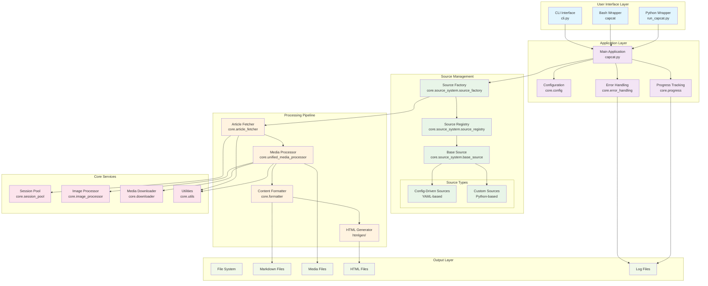

# System Architecture

## Component Relationships

- **UI Layer**: Entry points for user interaction
- **Application Layer**: Core application logic and coordination
- **Source Management**: Modular source system with auto-discovery
- **Processing Pipeline**: Article content processing workflow
- **Core Services**: Shared utilities and services
- **Output Layer**: File system operations and data persistence
