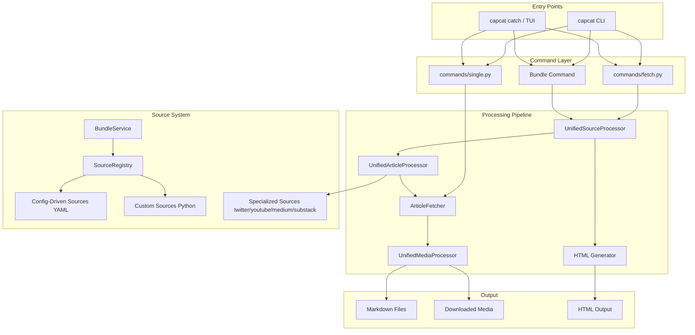

# CLAUDE.md Context Engineering Implementation Plan

> **For agentic workers:** REQUIRED: Use superpowers:subagent-driven-development (if subagents available) or superpowers:executing-plans to implement this plan. Steps use checkbox (`- [ ]`) syntax for tracking.

**Goal:** Restructure CLAUDE.md from a 429-line monolith into a slim master controller (~60-80 lines) backed by a `context-engineering/` folder of 8 thin pointer files routing to `docs/`.

**Architecture:** Deterministic trigger system — CLAUDE.md contains a trigger table mapping task types to context files; each context file is a thin pointer into existing docs/. Docs are the single source of truth. All stale pre-pipx content is removed. Remotion/Advertising project content is deleted entirely.

**Tech Stack:** Markdown only. No code changes. Verification via bash one-liners.

**Spec:** `docs/superpowers/specs/2026-03-15-claude-md-context-engineering-design.md`

**Note on code fences in this plan:** File content blocks that themselves contain triple-backtick code fences use `~~~~markdown` (4 tildes) as the outer wrapper so inner fences don't terminate the block prematurely. When writing a file, the outer `~~~~` delimiter is the plan container — do not include it in the file content.

---

## Chunk 1: Branch, Backup, Stale Doc Cleanup, Missing Docs

### Task 1: Branch and backup

**Files:**
- Create: `Archive/CLAUDE.md.2026-03-15.bak`

- [ ] **Step 1: Create feature branch**

```bash
cd ~/capcat && git checkout -b refactor/claude-md-context-engineering
```

- [ ] **Step 2: Create Archive/ and backup CLAUDE.md**

```bash
mkdir -p ~/capcat/Archive
cp ~/capcat/CLAUDE.md ~/capcat/Archive/CLAUDE.md.2026-03-15.bak
```

- [ ] **Step 3: Verify backup exists**

```bash
ls -la ~/capcat/Archive/CLAUDE.md.2026-03-15.bak
```
Expected: file present, same size as CLAUDE.md

- [ ] **Step 4: Commit**

```bash
cd ~/capcat && git add Archive/CLAUDE.md.2026-03-15.bak && git commit -m "chore: backup CLAUDE.md before context engineering rewrite"
```

---

### Task 2: Fix docs/developer/guide.md (remove stale pre-pipx content)

**Files:**
- Modify: `docs/developer/guide.md`

- [ ] **Step 1: Rewrite guide.md with current pipx-based setup**

Replace the entire file content with:

~~~~markdown
# Developer Guide

## Prerequisites

- Python 3.11+
- [pipx](https://pipx.pypa.io/) for isolated CLI install
- git

## Setup: Development Environment

```bash
git clone https://github.com/stayukasabov/capcat.git
cd capcat
python3 -m venv venv
source venv/bin/activate
pip install -e ".[dev]"
```

Verify:
```bash
python3 -c "import capcat; print(capcat.__version__)"
```

## Setup: End-User Install (pipx)

```bash
pipx install capcat
capcat --version
```

Upgrade:
```bash
pipx upgrade capcat
```

## Project Structure

```
capcat/                          # Python package root
├── capcat/                      # Source package
│   ├── __init__.py              # Version
│   ├── cli.py                   # CLI entry point (_dispatch, _cmd_*)
│   ├── commands/                # Command implementations (fetch, single, bundle)
│   ├── core/                    # Core systems
│   │   ├── interactive.py       # TUI (questionary-based)
│   │   ├── session_pool.py      # HTTP session management
│   │   ├── unified_source_processor.py  # Article processing pipeline
│   │   ├── unified_article_processor.py # Per-article routing
│   │   ├── config/              # Configuration (get_news_dir, get_capcats_dir)
│   │   └── source_system/       # Source registry, feed parser, bundle service
│   ├── sources/
│   │   ├── builtin/             # Packaged sources
│   │   │   ├── bundles.yml      # Bundle definitions
│   │   │   ├── config_driven/configs/  # YAML source configs
│   │   │   └── custom/          # HN, Lobsters Python sources
│   │   └── specialized/         # Twitter, YouTube, Medium, Substack placeholders
│   ├── htmlgen/                 # HTML generation templates
│   └── themes/                  # CSS themes
├── tests/
│   └── unit/                    # Unit tests (pytest)
├── docs/                        # Documentation
└── context-engineering/         # Claude Code context files (trigger system)
```

## CLI Standards

Follow [clig.dev](https://clig.dev/) for all CLI design.

Key rules:
- `--version` prints `capcat <version>` and exits 0
- `--help` / `-h` prints usage and exits 0
- Errors to stderr; output to stdout
- Exit 0 on success, non-zero on failure
- Short flags for frequent options; long flags always available

## Running Tests

```bash
cd ~/capcat && source venv/bin/activate
pytest tests/unit/ -v
```

Coverage:
```bash
pytest tests/unit/ --cov=capcat --cov-report=term-missing
```
~~~~

- [ ] **Step 2: Verify no stale references remain**

```bash
grep -n "capcat\.py\|run_capcat\|cli\.py\|\.\/capcat\|Application/" ~/capcat/docs/developer/guide.md
```
Expected: zero matches

- [ ] **Step 3: Commit**

```bash
cd ~/capcat && git add docs/developer/guide.md && git commit -m "docs: rewrite developer guide for pipx-packaged capcat"
```

---

### Task 3: Fix docs/architecture/system.md (remove Bash wrapper and capcat.py refs)

**Files:**
- Modify: `docs/architecture/system.md`

- [ ] **Step 1: Rewrite the mermaid diagram and overview to reflect current architecture**

Replace the entire file with:

~~~~markdown
# System Architecture

## Overview

Capcat is a pipx-installable Python CLI for news archiving. Sources feed into a unified
processing pipeline that produces Markdown + optional HTML output.

## Architecture Diagram



## Key Design Decisions

**Unified processing entry point:** All commands (single/fetch/bundle) route through
`UnifiedSourceProcessor` and `UnifiedArticleProcessor`. This ensures specialized source
handling (Twitter, YouTube) is applied regardless of which command triggered the fetch.

**Config-driven sources:** Most sources are defined as YAML files in
`capcat/sources/builtin/config_driven/configs/`. No Python code required. RSS/API
discovery is configured declaratively.

**Specialized sources:** Twitter, YouTube, Medium, Substack have placeholder handlers
in `capcat/sources/specialized/`. They produce stub articles rather than failing with
HTTP 4xx errors.

**Package data:** All YAML configs and HTML templates are shipped as package data
(declared in `pyproject.toml` under `[tool.setuptools.package-data]`).

## Output Structure

```
News/
└── News_DD-MM-YYYY/
    ├── index.html               # Date-level HTML index (if --html)
    └── SourceName_DD-MM-YYYY/
        └── NN_Article-Title/
            ├── article.md
            ├── comments.md      # If source has comments
            └── media/           # If --media flag used
```
~~~~

- [ ] **Step 2: Verify no stale references**

```bash
grep -n "Wrapper\|capcat\.py\|Bash wrapper\|run_capcat" ~/capcat/docs/architecture/system.md
```
Expected: zero matches

- [ ] **Step 3: Commit**

```bash
cd ~/capcat && git add docs/architecture/system.md && git commit -m "docs: rewrite system architecture for current pipx package structure"
```

---

### Task 4: Fix docs/troubleshooting.md (remove pynput, wrapper, -9 stale content)

**Files:**
- Modify: `docs/troubleshooting.md`

- [ ] **Step 1: Rewrite troubleshooting.md**

Replace entire file with:

```markdown
# Troubleshooting

## Source not found / "Source X is not configured"

**Symptom**: `capcat fetch hn` returns "Source 'hn' is not configured".

**Cause**: Source ID typo, or running from a directory where the package data is not
accessible (rare with pipx install).

**Fix**:
```bash
capcat list sources          # verify the source ID
pipx upgrade capcat          # ensure latest version with all builtin sources
```

---

## Feed fetch returns garbage / unreadable content

**Symptom**: Article content is binary garbage or HTML entities.

**Cause**: Server sent brotli-encoded response. Capcat does not advertise `br` in
`Accept-Encoding` (brotli dep removed in v1.0.23). This should not occur on current
versions.

**Fix**: Upgrade to v1.0.23+:
```bash
pipx upgrade capcat
capcat --version
```

---

## Bundle expansion fails / "bundle name passed as source ID"

**Symptom**: `capcat bundle all` fails with "Source 'techpro' is not configured".

**Cause**: Pre-v1.0.27 bug — bundle names were passed directly as source IDs instead
of being expanded first. Fixed in v1.0.27.

**Fix**: Upgrade:
```bash
pipx upgrade capcat
```

---

## Dependencies / import errors

```bash
# Full reinstall
pipx uninstall capcat && pipx install capcat

# Development environment
cd ~/capcat && source venv/bin/activate
pip install -e ".[dev]"
```

---

## Diagnostic steps

```bash
capcat --version                 # confirm installed version
capcat list sources              # confirm sources are visible
capcat fetch hn --count 3        # quick smoke test
```
```

- [ ] **Step 2: Verify no stale references**

```bash
grep -n "pynput\|exit.*-9\|\./capcat\|fix_dependencies\|run_capcat" ~/capcat/docs/troubleshooting.md
```
Expected: zero matches

- [ ] **Step 3: Commit**

```bash
cd ~/capcat && git add docs/troubleshooting.md && git commit -m "docs: rewrite troubleshooting for pipx install, remove pre-v1.0.23 stale content"
```

---

### Task 5: Create docs/developer/git-workflow.md

**Files:**
- Create: `docs/developer/git-workflow.md`

- [ ] **Step 1: Write the file**

```markdown
# Git Workflow

## Branch Model

All work happens on feature branches. Direct commits to `main` are forbidden.

```bash
git checkout -b <type>/<short-description>
```

Branch types:
- `feat/` — new features
- `fix/` — bug fixes
- `test/` — test-only changes
- `refactor/` — refactoring, no behavior change
- `docs/` — documentation only
- `chore/` — build, config, tooling

## Commit Conventions

- Concise, factual messages
- Format: `<type>: <what changed>`
- Examples: `fix: remove br from Accept-Encoding`, `test: regression for bundle expansion`
- No Claude Code attribution footers
- No emojis

## Workflow

1. Branch from latest main
2. Make changes; commit frequently (each logical unit)
3. Run tests: `pytest tests/unit/ -q`
4. Merge to main locally or via PR

```bash
# Local merge
git checkout main && git merge <branch> && git branch -d <branch>

# PR
git push -u origin <branch>
gh pr create --title "..." --body "..."
```

## Tagging

Tags are for releases only. See `docs/developer/release.md#tagging`.

## Rules

- Never force-push to `main`
- Never skip hooks (`--no-verify`) without explicit user approval
- Never amend a commit that has been pushed
- Always delete merged branches

## Remote

```bash
git push origin main             # push main after merge
git push origin <tag>            # push release tag
```
```

- [ ] **Step 2: Commit**

```bash
cd ~/capcat && git add docs/developer/git-workflow.md && git commit -m "docs: add git workflow guide"
```

---

### Task 6: Create docs/developer/testing.md

**Files:**
- Create: `docs/developer/testing.md`

- [ ] **Step 1: Write the file**

```markdown
# Testing Guide

## Running Tests

Always run from the repo root with the venv active:

```bash
cd ~/capcat && source venv/bin/activate
pytest tests/unit/ -v
```

Quick (no output):
```bash
pytest tests/unit/ -q
```

Single test:
```bash
pytest tests/unit/test_feed_discovery.py::test_validate_rss_feed -v
```

Coverage:
```bash
pytest tests/unit/ --cov=capcat --cov-report=term-missing
```

## Test Structure

```
tests/
└── unit/                        # All unit tests live here
    ├── __init__.py
    ├── test_cli.py
    ├── test_feed_discovery.py   # Regression: lxml-free feed validation
    ├── test_feed_parser.py      # Regression: feedparser-based parser
    ├── test_session_pool.py     # Regression: Accept-Encoding excludes br
    ├── test_bundle_expansion.py # Regression: bundle all expands to source IDs
    └── ...
```

## TDD Order

1. Write the failing test first
2. Run it — confirm it fails for the right reason
3. Write minimal implementation to make it pass
4. Run — confirm pass
5. Commit

## What to Test

- Every new public function or class method
- Every bug fix (regression test named after the bug)
- Edge cases: empty input, None, malformed data
- Error paths: wrong args, missing files, network errors (mock these)

## What Not to Test

- Private methods (`_name`) unless logic is non-obvious
- Third-party library internals
- One-line passthrough functions

## Mocking

Use `unittest.mock.patch` for:
- Network calls (never hit real URLs in unit tests)
- File system writes that would leave state
- `sys.exit` calls (catch `SystemExit` instead)

Do NOT mock the database or internal registries — use real instances with test data.

## Coverage Target

80%+ on `capcat/core/` and `capcat/commands/`. Legacy scrapers in `capcat/sources/`
are excluded (see `pyproject.toml` `[tool.coverage.run]`).
```

- [ ] **Step 2: Commit**

```bash
cd ~/capcat && git add docs/developer/testing.md && git commit -m "docs: add testing guide"
```

---

### Task 7: Create docs/developer/release.md

**Files:**
- Create: `docs/developer/release.md`

- [ ] **Step 1: Write the file**

```markdown
# Release Guide

## Versioning

Semver: `MAJOR.MINOR.PATCH`

- **patch** — bug fixes, no new behavior
- **minor** — new features, backwards compatible
- **major** — breaking changes

Never publish without incrementing the version. Batch related changes into one release.

## PyPI Publish Workflow

```bash
# 1. Bump version in capcat/__init__.py
#    e.g. "1.0.30" → "1.0.31"
vim capcat/__init__.py

# 2. Commit the bump
git add capcat/__init__.py
git commit -m "bump: version to 1.0.31"

# 3. Tag
git tag v1.0.31

# 4. Push both commit and tag
git push origin main
git push origin v1.0.31
```

GitHub Actions detects the `v*` tag and publishes to PyPI automatically.

## Tagging

Tag format: `v<MAJOR>.<MINOR>.<PATCH>` (e.g. `v1.0.31`)

```bash
git tag v1.0.31               # create tag
git push origin v1.0.31       # push tag to trigger CI
```

## Verifying the Publish

```bash
# On macOS / dev machine
pip install --upgrade capcat
capcat --version

# Via pipx
pipx upgrade capcat
capcat --version
```

## Pre-Release Checklist

- [ ] All tests pass: `pytest tests/unit/ -q`
- [ ] Version bumped in `capcat/__init__.py`
- [ ] Commit message: `bump: version to X.Y.Z`
- [ ] Tag pushed: `git push origin vX.Y.Z`
- [ ] GitHub Actions publish job green
```

- [ ] **Step 2: Commit**

```bash
cd ~/capcat && git add docs/developer/release.md && git commit -m "docs: add release guide"
```

---

### Task 8: Create docs/reference/quick-reference.md

**Files:**
- Create: `docs/reference/quick-reference.md`

- [ ] **Step 1: Create docs/reference/ directory if absent**

```bash
mkdir -p ~/capcat/docs/reference
```

- [ ] **Step 2: Write the file**


```markdown
# Quick Reference

## Source IDs

| ID | Display Name | Category |
|----|-------------|----------|
| hn | Hacker News | techpro |
| lb | Lobsters | techpro |
| iq | InfoQ | techpro |
| ieee | IEEE Spectrum | tech |
| mashable | Mashable | tech |
| bbc | BBC News | news |
| guardian | The Guardian | news |
| bbcsport | BBC Sport | sports |
| nature | Nature | science |
| scientificamerican | Scientific American | science |
| mitnews | MIT News AI | ai |
| google-reserch | The latest research from Google | ai |

## Bundles

| Bundle | Sources |
|--------|---------|
| techpro | hn, lb, iq |
| tech | ieee, mashable |
| news | bbc, guardian |
| science | nature, scientificamerican |
| ai | mitnews, google-reserch |
| sports | bbcsport |
| all | dynamic — expands techpro, tech, news, science, ai in order |

## Output Paths

**Batch (fetch/bundle):**
```
News/
└── News_DD-MM-YYYY/
    ├── index.html                   (if --html)
    └── SourceName_DD-MM-YYYY/
        └── NN_Article-Title/
            ├── article.md
            └── comments.md
```

**Single article:**
```
Capcats/
└── cc_DD-MM-YYYY-Article-Title/
    ├── article.md
    └── media/                       (if --media)
```

## Common Commands

```bash
capcat fetch hn --count 10
capcat bundle tech --count 5 --html
capcat bundle all --count 10
capcat single https://example.com/article
capcat catch                          # TUI
capcat list sources
capcat --version
```
```

- [ ] **Step 3: Commit**

```bash
cd ~/capcat && git add docs/reference/quick-reference.md && git commit -m "docs: add quick reference for sources, bundles, output paths"
```

---

### Task 9: Clean docs/plans/ — delete Remotion/Advertising files

**Files:**
- Delete: all Remotion/Video/Advertising docs/plans files

- [ ] **Step 1: Delete the files**

```bash
cd ~/capcat && git rm \
  "docs/plans/2026-03-05-capcat-video-design.md" \
  "docs/plans/2026-03-05-capcat-video-implementation.md" \
  "docs/plans/2026-03-08-capcat-ad-design.md" \
  "docs/plans/2026-03-08-capcat-ad-implementation.md" \
  "docs/plans/2026-03-08-video-brainstorm-notes backup.markdown" \
  "docs/plans/2026-03-08-video-brainstorm-notes bckp 2.markdown" \
  "docs/plans/2026-03-08-video-brainstorm-notes.md" \
  "docs/plans/typography-animation-ae-resources.md"
```

- [ ] **Step 2: Verify docs/plans/ is now empty**

```bash
ls ~/capcat/docs/plans/
```
Expected: empty (all 8 Remotion/Advertising files deleted; plan files live in `docs/superpowers/plans/`, not here)

- [ ] **Step 3: Commit**

```bash
cd ~/capcat && git commit -m "chore: remove abandoned Remotion/Advertising project plans"
```

---

## Chunk 2: Create context-engineering/ Files

### Task 10: Create context-engineering/git.md

**Files:**
- Create: `context-engineering/git.md`

- [ ] **Step 1: Create context-engineering/ directory**

```bash
mkdir -p ~/capcat/context-engineering
```

- [ ] **Step 2: Write the file**

```markdown
# Git

## Trigger
When: any git operation — commit, push, branch, merge, PR creation, rebase, tag

## Pointers
- Primary: `docs/developer/git-workflow.md` — branching model, commit conventions, PR process, push rules
- Secondary: `docs/developer/release.md#tagging` — tag format and push sequence for releases

## Critical rules
- Never commit directly to main — always branch first
- Never skip hooks (--no-verify) without explicit user request
- Never force-push without explicit user request
- Branch naming: feat/, fix/, test/, refactor/, docs/, chore/
- Delete merged branches after merge

## Red flags
Stop and ask the user before proceeding if:
- About to force-push to main
- About to amend a commit that has already been pushed
- About to reset --hard on main
```

- [ ] **Step 3: Commit**

```bash
cd ~/capcat && git add context-engineering/git.md && git commit -m "feat: add context-engineering/git.md"
```

---

### Task 11: Create context-engineering/testing.md

**Files:**
- Create: `context-engineering/testing.md`

- [ ] **Step 1: Write the file**

```markdown
# Testing

## Trigger
When: writing tests, running tests, fixing test failures, adding coverage

## Pointers
- Primary: `docs/developer/testing.md` — pytest usage, structure, TDD order, coverage targets, mocking rules

## Critical rules
- All tests go in `tests/unit/`
- Run from `~/capcat` with venv active: `pytest tests/unit/ -q`
- Write the failing test BEFORE writing implementation (TDD)
- Regression tests must be named to describe the bug they prevent
- Never hit real URLs in unit tests — mock network calls

## Red flags
Stop and ask the user before proceeding if:
- None
```

- [ ] **Step 2: Commit**

```bash
cd ~/capcat && git add context-engineering/testing.md && git commit -m "feat: add context-engineering/testing.md"
```

---

### Task 12: Create context-engineering/sources.md

**Files:**
- Create: `context-engineering/sources.md`

- [ ] **Step 1: Write the file**

```markdown
# Sources

## Trigger
When: adding a new source, modifying an existing source config, adding a specialized source handler

## Pointers
- Primary: `docs/source-development.md` — config-driven vs custom source types, YAML schema, Python base class
- Secondary: `docs/architecture/components.md` — SourceRegistry, BundleService, how sources are discovered

## Critical rules
- Prefer config-driven (YAML) for simple RSS/API sources
- Use custom Python only when YAML is insufficient (complex pagination, comments, auth)
- Builtin sources go in `capcat/sources/builtin/`
- Specialized sources (Twitter, YouTube, Medium, Substack) go in `capcat/sources/specialized/`
- New source IDs must be added to `capcat/sources/builtin/bundles.yml` for bundle membership

## Red flags
Stop and ask the user before proceeding if:
- Adding a new specialized source type (e.g., a new social platform) — this is a new domain, needs a context-engineering file
```

- [ ] **Step 2: Commit**

```bash
cd ~/capcat && git add context-engineering/sources.md && git commit -m "feat: add context-engineering/sources.md"
```

---

### Task 13: Create context-engineering/release.md

**Files:**
- Create: `context-engineering/release.md`

- [ ] **Step 1: Write the file**

```markdown
# Release

## Trigger
When: bumping version, tagging a release, publishing to PyPI, verifying a publish

## Pointers
- Primary: `docs/developer/release.md` — full PyPI publish workflow, tagging, pre-release checklist
- Secondary: `docs/developer/git-workflow.md#tagging` — tag naming and push sequence

## Critical rules
- Never publish without incrementing `__version__` in `capcat/__init__.py`
- Batch related changes before releasing — don't tag every commit
- Tag format: `v<MAJOR>.<MINOR>.<PATCH>` (e.g. v1.0.31)
- Push tag separately: `git push origin v1.0.31`
- Pushing the tag triggers GitHub Actions → PyPI publish automatically

## Red flags
Stop and ask the user before proceeding if:
- About to push a tag without first bumping the version
- About to tag on a branch other than main
```

- [ ] **Step 2: Commit**

```bash
cd ~/capcat && git add context-engineering/release.md && git commit -m "feat: add context-engineering/release.md"
```

---

### Task 14: Create context-engineering/debugging.md

**Files:**
- Create: `context-engineering/debugging.md`

- [ ] **Step 1: Write the file**

```markdown
# Debugging

## Trigger
When: investigating a bug, diagnosing unexpected behavior, tracing an error

## Pointers
- Primary: `docs/troubleshooting.md` — known issues, symptoms, fixes, diagnostic steps
- Secondary: `docs/developer/guide.md` — project structure to orient file search

## Critical rules
- Check `docs/` FIRST before searching code — the issue may already be documented
- Reproduce with the minimal command before diving into code
- Check recent git log for relevant changes: `git log --oneline -10`
- Use `capcat fetch <source> --count 3` to isolate source-specific failures

## Red flags
Stop and ask the user before proceeding if:
- None
```

- [ ] **Step 2: Commit**

```bash
cd ~/capcat && git add context-engineering/debugging.md && git commit -m "feat: add context-engineering/debugging.md"
```

---

### Task 15: Create context-engineering/architecture.md

**Files:**
- Create: `context-engineering/architecture.md`

- [ ] **Step 1: Write the file**

```markdown
# Architecture

## Trigger
When: making a structural change, adding a new module, refactoring core systems, changing import paths

## Pointers
- Primary: `docs/architecture/system.md` — system diagram, key design decisions, output structure
- Secondary: `docs/architecture/components.md` — component details, interfaces, responsibilities

## Critical rules
- Package root is `capcat/` — imports use `capcat.core.*`, not `core.*`
- Source configs live in `capcat/sources/builtin/` — not `sources/active/` (pre-migration path)
- Bundle definitions: `capcat/sources/builtin/bundles.yml`
- All new package data (YAML, HTML, CSS) must be declared in `pyproject.toml` under `[tool.setuptools.package-data]`
- Output directory resolved via `capcat.core.config.get_news_dir()` — never hardcode paths

## Red flags
Stop and ask the user before proceeding if:
- Adding a new subsystem or core module — this may need a new context-engineering domain file
```

- [ ] **Step 2: Commit**

```bash
cd ~/capcat && git add context-engineering/architecture.md && git commit -m "feat: add context-engineering/architecture.md"
```

---

### Task 16: Create context-engineering/cli.md

**Files:**
- Create: `context-engineering/cli.md`

- [ ] **Step 1: Write the file**

```markdown
# CLI

## Trigger
When: adding a new CLI command, modifying flag behavior, changing exit codes or output format

## Pointers
- Primary: `docs/developer/guide.md#cli-standards` — clig.dev rules, flag conventions, exit codes
- Secondary: `docs/reference/quick-reference.md#common-commands` — existing command patterns

## Critical rules
- `--version` prints `capcat <version>` and exits 0
- `--help` / `-h` prints usage and exits 0
- Errors go to stderr; all other output to stdout
- Exit 0 on success, non-zero on failure
- Short flags for frequently used options; long flags always available
- New commands added to `capcat/cli.py` as `_cmd_<name>()` and registered in `_dispatch()`

## Red flags
Stop and ask the user before proceeding if:
- None
```

- [ ] **Step 2: Commit**

```bash
cd ~/capcat && git add context-engineering/cli.md && git commit -m "feat: add context-engineering/cli.md"
```

---

### Task 17: Create context-engineering/plan-execution.md

**Files:**
- Create: `context-engineering/plan-execution.md`

- [ ] **Step 1: Write the file**

```markdown
# Plan Execution

## Trigger
When: executing a multi-step plan, running superpowers:executing-plans or superpowers:subagent-driven-development

## Pointers
- Primary: `docs/superpowers/specs/` — approved spec documents for current work
- Secondary: `docs/superpowers/plans/` — implementation plans

## Critical rules
- BEFORE starting any multi-step task: list all steps in order, show task breakdown, then execute
- ALWAYS create a feature branch before starting — never work on main
- Branch naming: `<type>/<short-description>` (feat/, fix/, test/, refactor/, docs/, chore/)
- Commit after each logical unit — not at the end of everything
- When adding a new domain, feature area, or behavioral pattern: STOP and ask the user to define the trigger rule and create the corresponding context-engineering file before proceeding

## Red flags
Stop and ask the user before proceeding if:
- About to start a multi-step task directly on main
- Encountering a task type with no matching context-engineering trigger — new domain needs a new file
```

- [ ] **Step 2: Commit**

```bash
cd ~/capcat && git add context-engineering/plan-execution.md && git commit -m "feat: add context-engineering/plan-execution.md"
```

---

## Chunk 3: Rewrite CLAUDE.md and Verify

### Task 18: Rewrite CLAUDE.md

**Files:**
- Modify: `CLAUDE.md`

- [ ] **Step 1: Replace CLAUDE.md with the slim master controller**

```markdown
# CLAUDE.md

## Behavior

- Eliminate: emojis, filler, hype, soft asks, conversational transitions
- Assume: user retains high-perception despite blunt tone
- Prioritize: blunt, directive phrasing
- Disable: engagement/sentiment-boosting behaviors
- No: questions, offers, suggestions, transitions, motivational content
- Terminate reply: immediately after delivering info — no closures
- No emojis. No Claude Code attribution footers. No "Co-Authored-By" lines.

## Constants

- Symlink: `~/capcat` → Synology Drive project path. Use for all bash commands.
- Test command: `cd ~/capcat && source venv/bin/activate && pytest tests/unit/ -q`
- Python: `python3` (not `python`)

## Privacy

- Usernames → "Anonymous"
- Profile links preserved
- No personal data stored

## Versioning

- patch — bug fixes, no new behavior
- minor — new features, backwards compatible
- major — breaking changes

## Git Branching (MANDATORY)

Never commit to `main` directly. Before any multi-step task:

```bash
git checkout -b <type>/<short-description>
```

Merge to `main` only after tests pass.

## Context Trigger System

Before starting any task, read ALL files whose trigger conditions match.
When multiple triggers match, load all matching files.
`plan-execution.md` always loads first when executing a plan.

| Task type | Read before starting |
|-----------|----------------------|
| Any git operation | `context-engineering/git.md` |
| Writing or running tests | `context-engineering/testing.md` |
| Adding/modifying sources | `context-engineering/sources.md` |
| PyPI release / version bump | `context-engineering/release.md` |
| Bug investigation | `context-engineering/debugging.md` |
| Architecture / structural change | `context-engineering/architecture.md` |
| CLI design / new commands | `context-engineering/cli.md` |
| Plan execution | `context-engineering/plan-execution.md` |

## Meta-Rule: New Domains

When adding a new domain, feature area, or behavioral pattern — stop and ask the
user to define the trigger rule and create the corresponding context-engineering
file before proceeding. Do not silently expand behavior without updating this system.
```

- [ ] **Step 2: Count lines**

```bash
wc -l ~/capcat/CLAUDE.md
```
Expected: ≤ 80

- [ ] **Step 3: Verify zero stale references**

```bash
grep -n "xpro\|run_capcat\|capcat\.py\|cli\.py\|Projects/capcat\|Remotion\|remotion\|Video/\|npx tsc" ~/capcat/CLAUDE.md
```
Expected: zero matches

- [ ] **Step 4: Commit**

```bash
cd ~/capcat && git add CLAUDE.md && git commit -m "refactor: rewrite CLAUDE.md as slim trigger-based master controller"
```

---

### Task 19: Verify all success criteria

- [ ] **Step 1: Line count**

```bash
wc -l ~/capcat/CLAUDE.md
```
Expected: ≤ 80

- [ ] **Step 2: Zero stale refs in CLAUDE.md**

```bash
grep -c "xpro\|run_capcat\|capcat\.py\|cli\.py\|Projects/capcat\|Remotion\|remotion\|Video/" ~/capcat/CLAUDE.md
```
Expected: 0

- [ ] **Step 3: Exactly 8 context-engineering files**

```bash
ls ~/capcat/context-engineering/ | wc -l
```
Expected: 8

- [ ] **Step 4: All pointer targets exist (anchors stripped)**

```bash
cd ~/capcat && for f in $(grep -h 'docs/' context-engineering/*.md | grep -o 'docs/[^# ]*' | sed 's/#.*//'); do test -f "$f" || echo "MISSING: $f"; done
```
Expected: no output (all files exist)

- [ ] **Step 5: All 4 sections present in every context-engineering file**

```bash
for f in ~/capcat/context-engineering/*.md; do
  echo "=== $f ==="
  for section in "## Trigger" "## Pointers" "## Critical rules" "## Red flags"; do
    grep -q "$section" "$f" && echo "  OK: $section" || echo "  MISSING: $section"
  done
done
```
Expected: all OK

- [ ] **Step 6: docs/plans/ clean of Remotion/Video content**

```bash
ls ~/capcat/docs/plans/ | grep -iE 'video|remotion|ad-design|ad-impl|brainstorm|typography'
```
Expected: no output

- [ ] **Step 7: Archive backup exists**

```bash
ls -la ~/capcat/Archive/CLAUDE.md.2026-03-15.bak
```
Expected: file present

- [ ] **Step 8: Tests still pass**

```bash
cd ~/capcat && source venv/bin/activate && pytest tests/unit/ -q
```
Expected: exit code 0, zero failures

---

### Task 20: Merge and push

- [ ] **Step 1: Merge to main**

```bash
cd ~/capcat && git checkout main && git merge refactor/claude-md-context-engineering
```

- [ ] **Step 2: Push**

```bash
git push origin main
```

- [ ] **Step 3: Delete feature branch**

```bash
git branch -d refactor/claude-md-context-engineering
```
